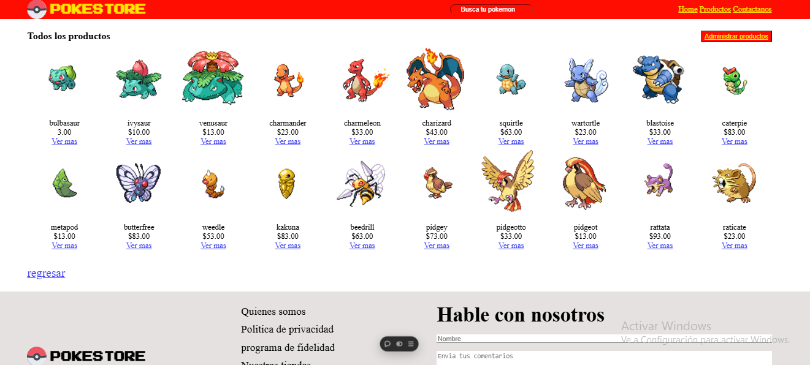

# E-comer Pokemon

una tienda virtual utilizando la API de pokemon simulando que son articulos,
se puede ver detalles agregar y eliminar productos

## Tecnologías Utilizadas
- HTML5
- CSS3
- JavaScript
- axios

## Funcionalidades
- [x] Página responsiva
- [x] Animaciones con CSS
- [x] Interacción mediante JavaScript
- [x] Peticion CRUD con axios

## Captura de Pantalla

## Link en vercel
[E-comer](https://e-comer2.vercel.app/ "Title")
